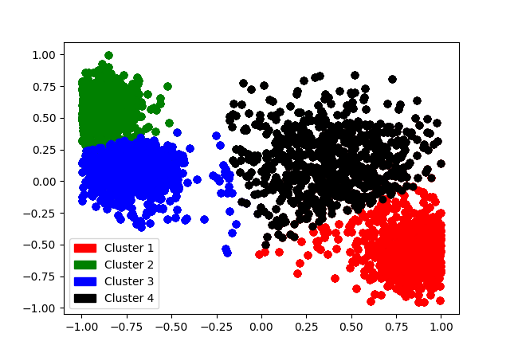

# K-Means Clustering

This repository contains a Python implementation of the K-Means clustering algorithm. K-Means is a popular unsupervised learning algorithm used to cluster data points into groups based on their similarity.

## Overview

The `kmeans.py` script executes the following steps:

1. **Initialization**: Randomly initialize cluster centroids.
2. **Assignment**: Assign each data point to the nearest cluster centroid.
3. **Update**: Update cluster centroids based on the mean of data points assigned to each cluster.
4. **Convergence**: Repeat steps 2 and 3 until no data points change (called convergence).

## Prerequisites

Ensure you have `Python 3` and `pip` installed on your system. Additionally, this program requires the 
`matplotlib` library to plot the clustering results.

You can install `matplotlib` with pip by using the following command:

`pip install matplotlib`

## Installation

1. **Clone the Repository:**

   ```
   git clone https://github.com/joaotav/kmeans-cluster-visualizer.git
   ```

## File Structure

The repository contains the following files:

- `kmeans_clustering.py`: The main Python script implementing the K-Means algorithm.
- `dataset.txt`: Input dataset containing coordinates of data points.
- `result.dat`: Output file containing the final clustering result.
- `clusters.png`: Output file containing the visualization of clustered data points.

## Usage

To execute the clustering algoritm based on the dataset specified in the `dataset.txt` file, run the following command:

```
python3 kmeans.py
```
### Example Output (`dataset.txt`)


